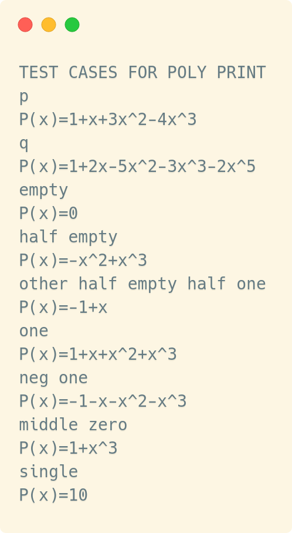

= Abgabe 2: Polynome
:author: Florian Weingartshofer 
:email: <S1910307103@students.fh-hagenberg.at>
:reproducible:
:listing-caption: Listing
:source-highlighter: rouge
:sourcedir: ../src/

== poly_print
=== Lösungsidee
Die Polynomfunktion soll ausgegeben werden, dabei gibt es zu beachten:

- Multiplikator ist negativ, dann soll kein Plus Symbol ausgegeben werden.
- Multiplikator ist 0, dann soll nichts ausgegeben werden.
- Multiplikator ist 0 oder 1, dann soll nur `x` mit der Potenz ausgegeben werden.
- Potenz ist 0, dann soll nur der Multiplikator ausgegeben werden.
- Potenz ist 1, dann soll diese nicht ausgegeben werden.

<<<
=== Testfälle
[source,c]
----
include::{sourcedir}/poly/poly.c[lines=270..301]
----

<<<
==== Ergebnis
[source]
----
TEST CASES FOR POLY PRINT
p
P(x)=1+x+3x^2-4x^3
q
P(x)=1+2x-5x^2-3x^3-2x^5
empty
P(x)=0
half empty
P(x)=-x^2+x^3
other half empty half one
P(x)=-1+x
one
P(x)=1+x+x^2+x^3
neg one
P(x)=-1-x-x^2-x^3
middle zero
P(x)=1+x^3
single
P(x)=10
----

<<<
== poly_evaluate
=== Lösungsidee
Es wird einfach für `x` in einer Polynomfunktion eingesetzt, 
dann wird die Zahl mit der Potenz evaluiert und mit dem Multiplikant
ausgerechnet. Zuletzt werden die Ergebnisse von `k*x^n` aufsummiert
und zurückgegeben.

=== Testfälle
[source,c]
----
include::{sourcedir}/poly/poly.c[lines=303..327]
----

<<<
==== Ergebnis
[source]
----
TEST CASES FOR POLY EVALUATE
f(pi)=-56.1703=-56.1703
p(1)=1=1
p(5)=-419=-419
p(10)=-3689=-3689
q(1)=-3=-3
q(0)=1=1
single(1)=10=10
single(10)=10=10
null(1)=0=0
null(10)=0=0
----

<<<
== poly_add
=== Lösungsidee
Es werden die Multiplikanten an der Stelle `i` aufsummiert.
Sollte eine Polynomfunktion kürzer sein, 
wird für den Multiplikanten, an der Stelle `i`, `0` eingesetzt.
Die resultierende Polynomfunktion wird in `r` geschrieben.

=== Testfälle
[source,c]
----
include::{sourcedir}/poly/poly.c[lines=329..355]
----

==== Ergebnis
[source]
----
TEST CASES FOR POLY ADD
2+x-x^2-4x^3=P(x)=2+x-x^2-4x^3
5+4x+x^2-3x^3=P(x)=5+4x+x^2-3x^3
4+3x-2x^2+x^4=P(x)=4+3x-2x^2+x^3
----

<<<
== poly_mult
=== Lösungsidee
Um zu gewährleisten, dass `r` nur mit `0` befüllt ist, 
wird dies am Anfang der Funktion durchgeführt.
Die Polynomfunktionen werden mit zwei geschachtelten Schleifen durchgangen. 
Die Multiplikanten an den Stellen `i`, der ersten Polynomfunktion, 
und `j`, der zweiten Polynomfunktion,
werden multipliziert. 
Das Ergebnis wird an die Stell `i*j` von `r` geschrieben, 
bzw sollte bereits ein Wert vorhanden sein, 
wird das Ergebnis hinzu addiert.

=== Testfälle
[source,c]
----
include::{sourcedir}/poly/poly.c[lines=357..390]
----

=== Ergebnis
[source]
----
TEST CASES FOR POLY MULT
1+3x-6x^3-26x^4+11x^5+12x^6=P(x)=1+3x-6x^3-26x^4+11x^5+12x^6
1+x+3x^2-4x^3=P(x)=1+x+3x^2-4x^3
0=P(x)=0
x^2-2x^3+x^4=P(x)=x^2-2x^3+x^4
----

<<<
== poly_mult_fast
=== Lösungsidee
*Laut Angabe Implementiert.*

Die beiden Polynomfunktionen werden solange zweigeteilt, 
bis sie nur noch jeweils ein Element enthalten.
Dieses wird dann multipliziert und in `r` an der Stell 0 geschrieben.
Die daraus resultierenden `r`s werden dann laut den Formeln in der Angabe wieder zusammengefügt.

=== Testfälle
[source,c]
----
include::{sourcedir}/poly/poly.c[lines=392..425]
----

==== Ergebnis
[source]
----
TEST CASES FOR POLY MULT FAST
1+3x-6x^3-26x^4+11x^5+12x^6=P(x)=1+3x-6x^3-26x^4+11x^5+12x^6
1+2x+5x^2+x^3-x^5-4x^6=P(x)=1+2x+5x^2+x^3-x^5-4x^6
0=P(x)=0
x^2-2x^3+x^4=P(x)=x^2-2x^3+x^4
----

<<<
== Source Code
[source,c]
----
include::{sourcedir}/poly/poly.c[]
----