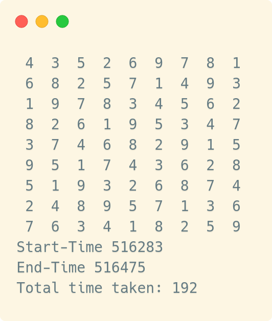
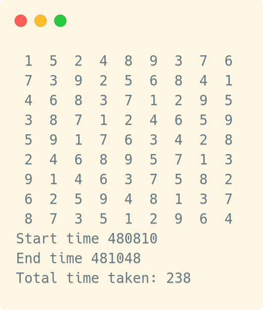
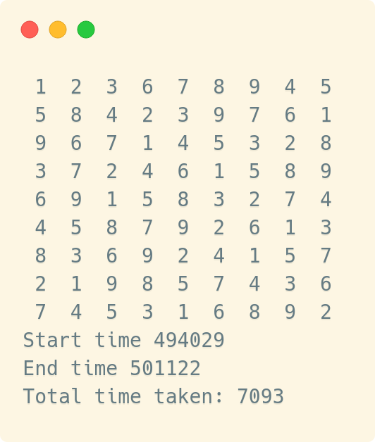
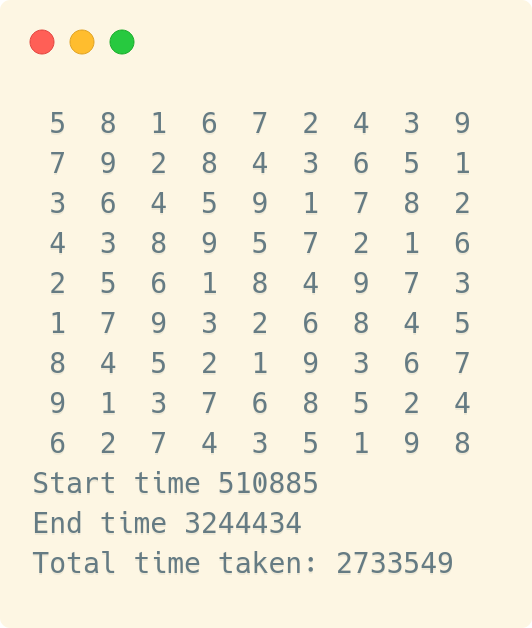
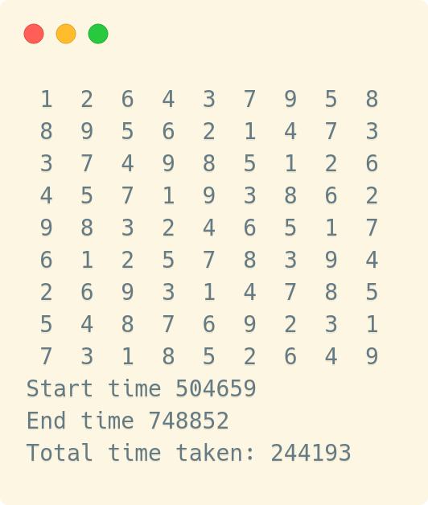
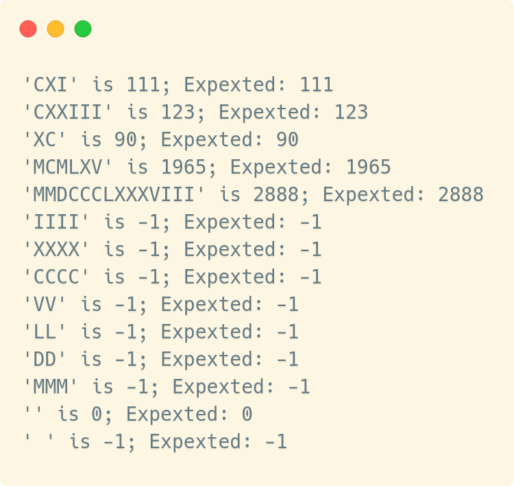
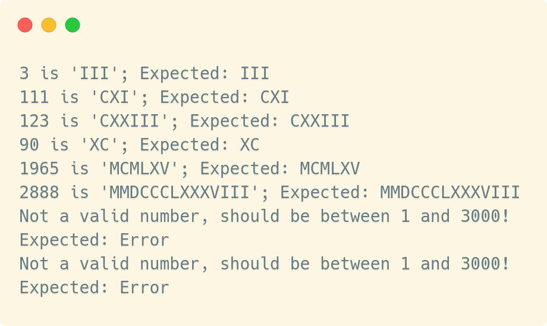

= Abgabe 3
:author: Florian Weingartshofer 
:email: <S1910307103@students.fh-hagenberg.at>
:reproducible:
:listing-caption: Listing
:source-highlighter: rouge
:sourcedir: ../src
:toc:
:toclevels: 4

<<<

== Sudoku
=== Lösungsidee
*Annahme: Ein echtes Sudoku hat GENAU eine Lösung, für mehr Infos siehe https://en.wikipedia.org/wiki/Sudoku[Wiki]!*

Mithilfe des Backtrackingverfahrens, wird versucht eine Ziffer `0 < n < 10` in die leeren Felder des Sudokus einzusetzen.
Da das Sudoku als 1-dimmensionaler Array dargestellt wird, wird es der Reihe nach von 0 bis exkl. 81 durchgegangen.
Beginnend an der Stelle `i=0` wird versucht die Ziffer `n` an der Stelle `i` einzusetzen.
Bevor die Ziffer tatsächlich in den Array geschrieben wird, wird überprüft ob sie auch dort erlaubt ist:

- Eine Ziffer darf nur einmal in einer Spalte/Reihe vorkommen
- Eine Ziffer darf nur einmal in einer 3x3 Zelle vorkommen

Wenn die Ziffer nicht an der Stelle `i` stehen darf, wird die nächste ausprobiert, sollte keine passen,
muss ein Schritt zurückgegangen werden und dort weiter probiert werden.

Sollte die Ziffer allerdings passen, wird die Backtracking Funktion erneut aufgerufen und das ganze wiederholt sich.

Wenn die Lösung gefunden wurde, wird diese auch ausgegeben.

=== Source Code
==== Header File
[source,c]
----
include::{sourcedir}/sudoku/sudoku.h[]
----
<<<
==== C-File
[source,c]
----
include::{sourcedir}/sudoku/sudoku.c[]
----

=== Test-Cases
Getestet werden Sudokus von Leicht zu Schwierig getestet.

*Gemessen mit `<time.h>`.*

<<<
==== Einfach
Input Grid
[source,c]
----
// Input grid
int grid[] =   {0, 0, 0, 2, 6, 0, 7, 0, 1,
                6, 8, 0, 0, 7, 0, 0, 9, 0,
                1, 9, 0, 0, 0, 4, 5, 0, 0,
                8, 2, 0, 1, 0, 0, 0, 4, 0,
                0, 0, 4, 6, 0, 2, 9, 0, 0,
                0, 5, 0, 0, 0, 3, 0, 2, 8,
                0, 0, 9, 3, 0, 0, 0, 7, 4,
                0, 4, 0, 0, 5, 0, 0, 3, 6,
                7, 0, 3, 0, 1, 8, 0, 0, 0};
----

Output:
[source]
----
 4  3  5  2  6  9  7  8  1 
 6  8  2  5  7  1  4  9  3 
 1  9  7  8  3  4  5  6  2 
 8  2  6  1  9  5  3  4  7 
 3  7  4  6  8  2  9  1  5 
 9  5  1  7  4  3  6  2  8 
 5  1  9  3  2  6  8  7  4 
 2  4  8  9  5  7  1  3  6 
 7  6  3  4  1  8  2  5  9 
Start-Time 516283
End-Time 516475
Total time taken: 192
----

==== Einfach 2
Input Grid
[source,c]
----
//Input grid
int grid[] = {1, 0, 0, 4, 8, 9, 0, 0, 6,
              7, 3, 0, 0, 0, 0, 0, 4, 0,
              0, 0, 0, 0, 0, 1, 2, 9, 5,
              0, 0, 7, 1, 2, 0, 6, 0, 0,
              5, 0, 0, 7, 0, 3, 0, 0, 8,
              0, 0, 6, 0, 9, 5, 7, 0, 0,
              9, 1, 4, 6, 0, 0, 0, 0, 0,
              0, 2, 0, 0, 0, 0 ,0, 3, 7,
              8, 0, 0, 5, 1, 2, 0, 0, 4};
----
Output;
[source]
----
 1  5  2  4  8  9  3  7  6 
 7  3  9  2  5  6  8  4  1 
 4  6  8  3  7  1  2  9  5 
 3  8  7  1  2  4  6  5  9 
 5  9  1  7  6  3  4  2  8 
 2  4  6  8  9  5  7  1  3 
 9  1  4  6  3  7  5  8  2 
 6  2  5  9  4  8  1  3  7 
 8  7  3  5  1  2  9  6  4 
Start time 480810
End time 481048
Total time taken: 238
----

==== Mittel
Input Grid
[source,c]
----
//Input grid
int grid[] = {0, 2, 0, 6, 0, 8, 0, 0, 0,
              5, 8, 0, 0, 0, 9, 7, 0, 0,
              0, 0, 0, 0, 4, 0, 0, 0, 0,
              3, 7, 0, 0, 0, 0, 5, 0, 0,
              6, 0, 0, 0, 0, 0, 0, 0, 4,
              0, 0, 8, 0, 0, 0, 0, 1, 3,
              0, 0, 0, 0, 2, 0, 0, 0, 0,
              0, 0, 9, 8, 0, 0, 0, 3, 6,
              0, 0, 0, 3, 0, 6, 0, 9, 0};
----
Output:
[source]
----
 1  2  3  6  7  8  9  4  5 
 5  8  4  2  3  9  7  6  1 
 9  6  7  1  4  5  3  2  8 
 3  7  2  4  6  1  5  8  9 
 6  9  1  5  8  3  2  7  4 
 4  5  8  7  9  2  6  1  3 
 8  3  6  9  2  4  1  5  7 
 2  1  9  8  5  7  4  3  6 
 7  4  5  3  1  6  8  9  2 
Start time 494029
End time 501122
Total time taken: 7093
----

==== Schwierig
Input Grid
[source,c]
----
//Input grid
int grid[] = {0, 0, 0, 6, 0, 0, 4, 0, 0,
              7, 0, 0, 0, 0, 3, 6, 0, 0,
              0, 0, 0, 0, 9, 1, 0, 8, 0,
              0, 0, 0, 0, 0, 0, 0, 0, 0,
              0, 5, 0, 1, 8, 0, 0, 0, 3,
              0, 0, 0, 3, 0, 6, 0, 4, 5,
              0, 4, 0, 2, 0, 0, 0, 6, 0,
              9, 0, 3, 0, 0, 0, 0, 0, 0,
              0, 2, 0, 0, 0, 0, 1, 0, 0};
----
Output
[source]
----
 5  8  1  6  7  2  4  3  9 
 7  9  2  8  4  3  6  5  1 
 3  6  4  5  9  1  7  8  2 
 4  3  8  9  5  7  2  1  6 
 2  5  6  1  8  4  9  7  3 
 1  7  9  3  2  6  8  4  5 
 8  4  5  2  1  9  3  6  7 
 9  1  3  7  6  8  5  2  4 
 6  2  7  4  3  5  1  9  8 
Start time 510885
End time 3244434
Total time taken: 2733549
----

==== Sehr Schwer
Input Grid
[source,c]
----
//Input grid
int grid[] = {0, 2, 0, 0, 0, 0, 0, 0, 0,
              0, 0, 0, 6, 0, 0, 0, 0, 3,
              0, 7, 4, 0, 8, 0, 0, 0, 0,
              0, 0, 0, 0, 0, 3, 0, 0, 2,
              0, 8, 0, 0, 4, 0, 0, 1, 0,
              6, 0, 0, 5, 0, 0, 0, 0, 0,
              0, 0, 0, 0, 1, 0, 7, 8, 0,
              5, 0, 0, 0, 0, 9, 0, 0, 0,
              0, 0, 0, 0, 0, 0, 0, 4, 0};
----

Output
[source]
----
 1  2  6  4  3  7  9  5  8 
 8  9  5  6  2  1  4  7  3 
 3  7  4  9  8  5  1  2  6 
 4  5  7  1  9  3  8  6  2 
 9  8  3  2  4  6  5  1  7 
 6  1  2  5  7  8  3  9  4 
 2  6  9  3  1  4  7  8  5 
 5  4  8  7  6  9  2  3  1 
 7  3  1  8  5  2  6  4  9 
Start time 504659
End time 748852
Total time taken: 244193
----

== Roman
=== Roman To Decimal
==== Lösungsidee
*Annahme: Die Ziffer `M` darf öfters als dreimal vorkommen*

Es wird der String `r` Character für Character durch iteriert,
die einzelnen Zeichen werden dann auf dezimale Werte gemappt, 
sollte ein Zeichen keine römische Ziffer sein, wird `-1` zurückgegeben.

Dann wird gespeichert wie oft die spezifische Ziffer hintereinander vorkommt, 
sollte sie öfters als das erlaubte Maximum vorkommen wird wieder `-1` zurückgegeben.

Zuletzt wird überprüft ob mehrere gleiche Ziffern gefolgt von einer höheren Ziffer vorkommen,
wenn Ja, wird wieder `-1` zurückgegeben.

Danach wird der Wert der Ziffer zu einer Summe hinzugerechnet, sollte es sich um eine Ziffer handeln,
welche vor einer höheren steht, wird sie von der Summe subtrahiert.
Diese Summe wird am Ende zurückgegeben.

==== Source Code
[source,c]
----
include::{sourcedir}/roman/roman.c[lines=7..73]
----

<<<
==== Test-Cases
Input
[source,c]
----
include::{sourcedir}/roman/main.c[lines=8..41]
----

<<<
Output
[source]
----
'CXI' is 111; Expexted: 111
'CXXIII' is 123; Expexted: 123
'XC' is 90; Expexted: 90
'MCMLXV' is 1965; Expexted: 1965
'MMDCCCLXXXVIII' is 2888; Expexted: 2888
'IIII' is -1; Expexted: -1
'XXXX' is -1; Expexted: -1
'CCCC' is -1; Expexted: -1
'VV' is -1; Expexted: -1
'LL' is -1; Expexted: -1
'DD' is -1; Expexted: -1
'MMM' is -1; Expexted: -1
'' is 0; Expexted: 0
' ' is -1; Expexted: -1
----

<<<
=== Decimal to Roman
==== Lösungsidee
*Annahme: Die längste Ziffer unter 3000 ist maximal 14 Zeichen lang*
Es werden Werte der römischen Ziffern vor definiert, der Einfachkeit halber
werden auch Werte definiert, welche subtrahiert werden, zB `IX`.

Als erstes wird überprüft ob die Zahl zwischen 1 und 3000 ist, wenn nicht wird die Funktion abgebrochen.

Es werden alle vordefinierten Werte durchiteriert beginnend bei dem höchsten.
Sollte die Division von dem Wert durch die Ziffer größer 0 sein, wird die römische Ziffer in den Ziel String eingesetzt.
Dies wird mit dem selben Wert solange gemacht bis dieser nicht mehr größer als 0 dividiert,
dann wird der nächste Wert genommen.

<<<
==== Source Code
[source,c]
----
include::{sourcedir}/roman/roman.c[lines=75..108]
----

<<<
==== Test-Cases
Input
[source,c]
----
include::{sourcedir}/roman/main.c[lines=43..85]
----

<<<
Output
[source]
----
3 is 'III'; Expected: III
111 is 'CXI'; Expected: CXI
123 is 'CXXIII'; Expected: CXXIII
90 is 'XC'; Expected: XC
1965 is 'MCMLXV'; Expected: MCMLXV
2888 is 'MMDCCCLXXXVIII'; Expected: MMDCCCLXXXVIII
Not a valid number, should be between 1 and 3000!
Expected: Error
Not a valid number, should be between 1 and 3000!
Expected: Error
----

