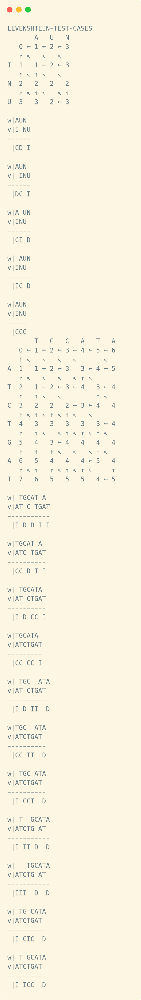
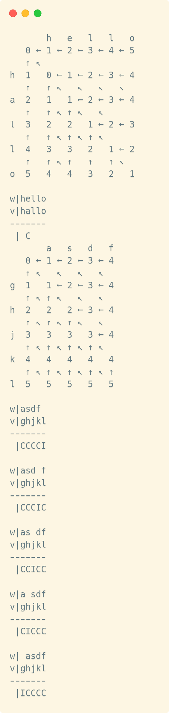
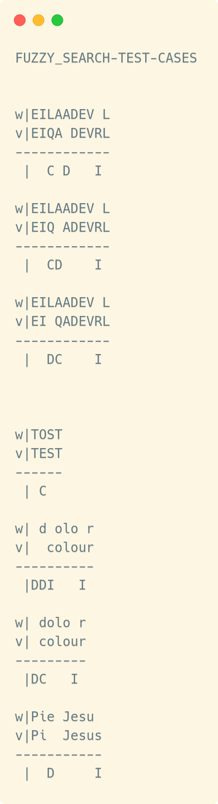

= Abgabe 4
:author: Florian Weingartshofer
:email: <S1910307103@students.fh-hagenberg.at>
:reproducible:
:listing-caption: Listing
:source-highlighter: rouge
:sourcedir: ../src
:toc:
:toclevels: 4

<<<
== Lösungsideen
=== Levenshteinabstand
Der Levenshteinabstand wird mithilfe einer Matrix berechnet,
welche mit den Formeln aus der Angabe berechnet wird.
Wie die Matrix zu Initialisieren ist, ist auch Teil der Angabe.
Die erste Spalte der Matrix wird aufsteigend initialisiert.
Die erste Zeile ebenso.

Um die Editiersequenzen einfach zusammen zu bauen,
wird die Matrix mit dem jeweiligen Wert an der Stelle `i,j` erstellt
und zusätzlich werden alle verfügbaren Operationen mitgespeichert.
Diese werden im Quelltext auch als Path bezeichnet.
So kann von einem Punkt in der Matrix ein Pfad nach links, oben
oder diagonal gehen.

Hier ein Beispiel:
[source]
----
       A   U   N
   0 ← 1 ← 2 ← 3
   ↑ ↖   ↖   ↖
I  1   1 ← 2 ← 3
   ↑ ↖ ↑ ↖   ↖
N  2   2   2   2 <1>
   ↑ ↖ ↑ ↖   ↖ ↑
U  3   3   2 ← 3 <2>
----
<1> Ein Wert in der Matrix,
welcher genau mit einer Operation erreicht wird.
<2> Hier kann der Wert über *gleich* drei Operationen erreicht werden.

'''
[#outpunt-func]
==== Erstellen und Ausgabe der Editiersequenzen
Die ganze Matrix wird von ganz rechts unten
nach links oben rekursiv durch iteriert.
Dabei wird immer einem Pfad gefolgt,
sollte es eine Verzweigung geben,
gibt es zwei oder mehr rekursive Aufrufe.
Jede Operation wird in einen Array aus Strings gespeichert.
An welche Stelle geschrieben wird,
wird durch einen Pointer, welcher auf den momentanen Index zeigt,
angegeben.

Zuletzt wird der Array aus Strings durch iteriert
und jede Editiersequenz umgekehrt ausgeben,
da die rekursive Funktion ja von hinten nach vorne durchlauft.

=== Längste gemeinsame Teilsequenze
Der Algorithmus basiert auf dem von der Levenshtein Distanz.
Die zwei Unterschiede sind die Formeln zum erstellen der Matrix,
welche sowieso Teil der Angabe waren und das Initialisieren der Matrix.
Die Initialisierung war wiederum auch Teil der Angabe,
der Unterschied hier liegt bei der ersten Zeile und Spalte,
welche mit Nullern initialisiert werden.

Zum Ausgeben wird <<outpunt-func,die oben beschriebene Ausgabe Funktion>> genutzt.

=== Unscharfe Mustersuche
*Annahme: Es wird nur der ERSTE beste Match genutzt, nicht alle, da die Angabe von EINEM Punkt spricht.*

Hier basiert der Algorithmus wieder sehr stark auf
dem der Levenshtein Distanz.
Die Unterschiede hier liegen bei der Initialisierung
und bei dem Berechnen der Editiersequenzen.
Initialsiert wird mit der ersten Zeile als Null und die erste Spalte aufsteigend.

Die Editiersequenz beginnt nicht ganz rechts unten,
sondern bei dem kleinsten Wert in der letzten Zeile.

<<<
== Source Code
*Anmerkung: Es wird als Rückgabetyp und auch für Indizes meist `size_t` statt `int` verwendet.*

=== align
.align.h
[source,c,linenums]
----
include::{sourcedir}/align/align.h[]
----
.align.c
[source,c,linenums]
----
include::{sourcedir}/align/align.c[]
----

=== utils
.utils.h
[source,c,linenums]
----
include::{sourcedir}/align/utils.h[]
----

.utils.c
[source,c,linenums]
----
include::{sourcedir}/align/utils.c[]
----

== Test-Cases
=== Levenshtein
.main.c
[source,c,linenums]
----
include::{sourcedir}/align/main.c[lines=6..22]
----

.Levenshtein-Output
[source]
----
LEVENSHTEIN-TEST-CASES
       A   U   N
   0 ← 1 ← 2 ← 3
   ↑ ↖   ↖   ↖
I  1   1 ← 2 ← 3
   ↑ ↖ ↑ ↖   ↖
N  2   2   2   2
   ↑ ↖ ↑ ↖   ↖ ↑
U  3   3   2 ← 3

w|AUN
v|I NU
------
 |CD I

w|AUN
v| INU
------
 |DC I

w|A UN
v|INU
------
 |CI D

w| AUN
v|INU
------
 |IC D

w|AUN
v|INU
-----
 |CCC
       T   G   C   A   T   A
   0 ← 1 ← 2 ← 3 ← 4 ← 5 ← 6
   ↑ ↖   ↖   ↖   ↖       ↖
A  1   1 ← 2 ← 3   3 ← 4 ← 5
   ↑ ↖   ↖   ↖   ↖ ↑ ↖
T  2   1 ← 2 ← 3 ← 4   3 ← 4
   ↑   ↑ ↖   ↖         ↑ ↖
C  3   2   2   2 ← 3 ← 4   4
   ↑ ↖ ↑ ↖ ↑ ↖ ↑ ↖   ↖
T  4   3   3   3   3   3 ← 4
   ↑   ↑ ↖   ↖ ↑ ↖ ↑ ↖ ↑ ↖
G  5   4   3 ← 4   4   4   4
   ↑   ↑   ↑ ↖   ↖   ↖ ↑ ↖
A  6   5   4   4   4 ← 5   4
   ↑ ↖ ↑   ↑ ↖ ↑ ↖ ↑ ↖     ↑
T  7   6   5   5   5   4 ← 5

w| TGCAT A
v|AT C TGAT
-----------
 |I D D I I

w|TGCAT A
v|ATC TGAT
----------
 |CC D I I

w| TGCATA
v|AT CTGAT
----------
 |I D CC I

w|TGCATA
v|ATCTGAT
---------
 |CC CC I

w| TGC  ATA
v|AT CTGAT
-----------
 |I D II  D

w|TGC  ATA
v|ATCTGAT
----------
 |CC II  D

w| TGC ATA
v|ATCTGAT
----------
 |I CCI  D

w| T  GCATA
v|ATCTG AT
-----------
 |I II D  D

w|   TGCATA
v|ATCTG AT
-----------
 |III  D  D

w| TG CATA
v|ATCTGAT
----------
 |I CIC  D

w| T GCATA
v|ATCTGAT
----------
 |I ICC  D
       h   e   l   l   o
   0 ← 1 ← 2 ← 3 ← 4 ← 5
   ↑ ↖
h  1   0 ← 1 ← 2 ← 3 ← 4
   ↑   ↑ ↖   ↖   ↖   ↖
a  2   1   1 ← 2 ← 3 ← 4
   ↑   ↑ ↖ ↑ ↖   ↖
l  3   2   2   1 ← 2 ← 3
   ↑   ↑ ↖ ↑ ↖ ↑ ↖
l  4   3   3   2   1 ← 2
   ↑   ↑ ↖ ↑   ↑   ↑ ↖
o  5   4   4   3   2   1

w|hello
v|hallo
-------
 | C
       a   s   d   f
   0 ← 1 ← 2 ← 3 ← 4
   ↑ ↖   ↖   ↖   ↖
g  1   1 ← 2 ← 3 ← 4
   ↑ ↖ ↑ ↖   ↖   ↖
h  2   2   2 ← 3 ← 4
   ↑ ↖ ↑ ↖ ↑ ↖   ↖
j  3   3   3   3 ← 4
   ↑ ↖ ↑ ↖ ↑ ↖ ↑ ↖
k  4   4   4   4   4
   ↑ ↖ ↑ ↖ ↑ ↖ ↑ ↖ ↑
l  5   5   5   5   5

w|asdf
v|ghjkl
-------
 |CCCCI

w|asd f
v|ghjkl
-------
 |CCCIC

w|as df
v|ghjkl
-------
 |CCICC

w|a sdf
v|ghjkl
-------
 |CICCC

w| asdf
v|ghjkl
-------
 |ICCCC

       g   h   j   k   l
   0 ← 1 ← 2 ← 3 ← 4 ← 5
   ↑ ↖   ↖   ↖   ↖   ↖
a  1   1 ← 2 ← 3 ← 4 ← 5
   ↑ ↖ ↑ ↖   ↖   ↖   ↖
s  2   2   2 ← 3 ← 4 ← 5
   ↑ ↖ ↑ ↖ ↑ ↖   ↖   ↖
d  3   3   3   3 ← 4 ← 5
   ↑ ↖ ↑ ↖ ↑ ↖ ↑ ↖   ↖
f  4   4   4   4   4 ← 5

w|ghjkl
v|asdf
-------
 |CCCCD

w|ghjkl
v|asd f
-------
 |CCCDC

w|ghjkl
v|as df
-------
 |CCDCC

w|ghjkl
v|a sdf
-------
 |CDCCC

w|ghjkl
v| asdf
-------
 |DCCCC
----

=== Längste gemeinsame Teilsequenz
Aus offensichtlichen Gründen hier der Output nur als Text.
Für den gesamten Output bitte `longest_shared_substr.txt` öffnen.

.main.c
[source,c]
----
include::{sourcedir}/align/main.c[lines=24..38]
----

.Longest-shared-substring
[source]
----
include::longest_shared_substr.txt[lines=1..123]
...
----

<<<
=== Unscharfe Mustersuche
*Anmerkung:
Beim Output kann es durch Spaces in den Test-Cases zu Ausgaben führen,
welche fehlerhaft aussehen, es aber nicht sind,
z.B. wenn ein Space gelöscht wird.*

.main.c
[source,c]
----
include::{sourcedir}/align/main.c[lines=40..54]
----

.Fuzzy-Search-Output
[source]
----
FUZZY_SEARCH-TEST-CASES
       S   V   L   Q   D   R   S   M   P   H   Q   E   I   L   A   A   D   E   V   L   Q   E   S   E   M   R   Q   Q   D   M   I   S   H   D   E
   0 ← 0 ← 0 ← 0 ← 0 ← 0 ← 0 ← 0 ← 0 ← 0 ← 0 ← 0 ← 0 ← 0 ← 0 ← 0 ← 0 ← 0 ← 0 ← 0 ← 0 ← 0 ← 0 ← 0 ← 0 ← 0 ← 0 ← 0 ← 0 ← 0 ← 0 ← 0 ← 0 ← 0 ← 0 ← 0
   ↑ ↖ ↑ ↖ ↑ ↖ ↑ ↖ ↑ ↖ ↑ ↖ ↑ ↖ ↑ ↖ ↑ ↖ ↑ ↖ ↑ ↖ ↑ ↖   ↖ ↑ ↖ ↑ ↖ ↑ ↖ ↑ ↖ ↑ ↖   ↖ ↑ ↖ ↑ ↖ ↑ ↖   ↖ ↑ ↖   ↖ ↑ ↖ ↑ ↖ ↑ ↖ ↑ ↖ ↑ ↖ ↑ ↖ ↑ ↖ ↑ ↖ ↑ ↖ ↑ ↖
E  1   1   1   1   1   1   1   1   1   1   1   1   0 ← 1   1   1   1   1   0 ← 1   1   1   0 ← 1   0 ← 1   1   1   1   1   1   1   1   1   1   0
   ↑ ↖ ↑ ↖ ↑ ↖ ↑ ↖ ↑ ↖ ↑ ↖ ↑ ↖ ↑ ↖ ↑ ↖ ↑ ↖ ↑ ↖ ↑   ↑ ↖       ↖ ↑ ↖ ↑ ↖ ↑   ↑ ↖   ↖ ↑ ↖ ↑   ↑ ↖     ↑ ↖   ↖ ↑ ↖ ↑ ↖ ↑ ↖ ↑ ↖ ↑ ↖   ↖ ↑ ↖ ↑ ↖ ↑   ↑
I  2   2   2   2   2   2   2   2   2   2   2   2   1   0 ← 1 ← 2   2   2   1   1 ← 2   2   1   1   1   1 ← 2   2   2   2   2   1 ← 2   2   2   1
   ↑ ↖ ↑ ↖ ↑ ↖ ↑ ↖   ↖ ↑ ↖ ↑ ↖ ↑ ↖ ↑ ↖ ↑ ↖ ↑ ↖     ↑   ↑ ↖   ↖   ↖ ↑ ↖ ↑   ↑ ↖ ↑ ↖   ↖     ↑ ↖ ↑ ↖ ↑ ↖ ↑ ↖   ↖   ↖   ↖ ↑ ↖ ↑   ↑ ↖   ↖ ↑ ↖ ↑   ↑
Q  3   3   3   3   2 ← 3   3   3   3   3   3   2   2   1   1 ← 2 ← 3   3   2   2   2   2   2   2   2   2   2   2   2 ← 3   3   2   2 ← 3   3   2
   ↑ ↖ ↑ ↖ ↑ ↖ ↑   ↑ ↖   ↖ ↑ ↖ ↑ ↖ ↑ ↖ ↑ ↖ ↑   ↑ ↖ ↑   ↑ ↖ ↑ ↖   ↖         ↑ ↖ ↑ ↖ ↑ ↖ ↑ ↖ ↑ ↖ ↑ ↖ ↑ ↖ ↑ ↖ ↑ ↖ ↑ ↖ ↑ ↖   ↖ ↑   ↑ ↖ ↑ ↖   ↖ ↑   ↑
A  4   4   4   4   3   3 ← 4   4   4   4   4   3   3   2   2   1 ← 2 ← 3   3   3   3   3   3   3   3   3   3   3   3   3 ← 4   3   3   3 ← 4   3
   ↑ ↖ ↑ ↖ ↑ ↖ ↑   ↑ ↖   ↖   ↖ ↑ ↖ ↑ ↖ ↑ ↖ ↑   ↑ ↖ ↑   ↑ ↖ ↑   ↑ ↖   ↖       ↖ ↑ ↖ ↑ ↖ ↑ ↖ ↑ ↖ ↑ ↖ ↑ ↖ ↑ ↖ ↑ ↖ ↑ ↖ ↑ ↖   ↖     ↑ ↖ ↑ ↖ ↑ ↖     ↑
D  5   5   5   5   4   3 ← 4 ← 5   5   5   5   4   4   3   3   2   2   2 ← 3 ← 4   4   4   4   4   4   4   4   4   4   3 ← 4   4   4   4   3 ← 4
   ↑ ↖ ↑ ↖ ↑ ↖ ↑   ↑   ↑ ↖   ↖   ↖ ↑ ↖ ↑ ↖ ↑   ↑ ↖     ↑ ↖ ↑   ↑ ↖ ↑ ↖ ↑ ↖           ↖ ↑ ↖   ↖ ↑ ↖   ↖ ↑ ↖ ↑ ↖ ↑ ↖ ↑   ↑ ↖   ↖ ↑ ↖ ↑ ↖ ↑   ↑ ↖
E  6   6   6   6   5   4   4 ← 5 ← 6   6   6   5   4   4   4   3   3   3   2 ← 3 ← 4 ← 5   4 ← 5   4 ← 5   5   5   5   4   4 ← 5   5   5   4   3
   ↑ ↖ ↑ ↖   ↖ ↑   ↑   ↑ ↖ ↑ ↖   ↖   ↖ ↑ ↖ ↑   ↑   ↑ ↖ ↑ ↖ ↑   ↑ ↖ ↑ ↖ ↑   ↑ ↖             ↑ ↖     ↑ ↖   ↖ ↑ ↖ ↑ ↖ ↑   ↑ ↖ ↑ ↖   ↖ ↑ ↖ ↑   ↑   ↑
V  7   7   6 ← 7   6   5   5   5 ← 6 ← 7   7   6   5   5   5   4   4   4   3   2 ← 3 ← 4 ← 5   5   5   5 ← 6   6   6   5   5   5 ← 6   6   5   4
   ↑ ↖ ↑   ↑ ↖     ↑   ↑ ↖   ↖ ↑ ↖   ↖   ↖ ↑   ↑   ↑ ↖ ↑ ↖ ↑   ↑ ↖ ↑ ↖ ↑   ↑   ↑ ↖   ↖   ↖   ↖ ↑ ↖ ↑ ↖ ↑ ↖       ↖ ↑   ↑ ↖ ↑ ↖ ↑ ↖   ↖ ↑   ↑   ↑
R  8   8   7   7   7   6   5 ← 6   6 ← 7 ← 8   7   6   6   6   5   5   5   4   3   3 ← 4 ← 5 ← 6   6   6   5 ← 6 ← 7   6   6   6   6 ← 7   6   5
   ↑ ↖ ↑   ↑ ↖   ↖ ↑   ↑   ↑ ↖   ↖ ↑ ↖   ↖     ↑   ↑ ↖ ↑ ↖     ↑ ↖ ↑ ↖ ↑   ↑   ↑ ↖   ↖   ↖   ↖   ↖ ↑ ↖ ↑   ↑ ↖   ↖     ↑ ↖ ↑ ↖ ↑ ↖ ↑ ↖     ↑   ↑
L  9   9   8   7 ← 8   7   6   6 ← 7   7 ← 8   8   7   7   6   6   6   6   5   4   3 ← 4 ← 5 ← 6 ← 7   7   6   6 ← 7   7   7   7   7   7   7   6

w|EILAADEV L
v|EIQA DEVRL
------------
 |  C D   I

w|EILAADEV L
v|EIQ ADEVRL
------------
 |  CD    I

w|EILAADEV L
v|EI QADEVRL
------------
 |  DC    I
       T   O   S   T   -   -   -   -   -   -   T   A   S   T   E
   0 ← 0 ← 0 ← 0 ← 0 ← 0 ← 0 ← 0 ← 0 ← 0 ← 0 ← 0 ← 0 ← 0 ← 0 ← 0
   ↑ ↖   ↖ ↑ ↖ ↑ ↖   ↖ ↑ ↖ ↑ ↖ ↑ ↖ ↑ ↖ ↑ ↖ ↑ ↖   ↖ ↑ ↖ ↑ ↖   ↖ ↑
T  1   0 ← 1   1   0 ← 1   1   1   1   1   1   0 ← 1   1   0 ← 1
   ↑   ↑ ↖   ↖ ↑   ↑ ↖   ↖ ↑ ↖ ↑ ↖ ↑ ↖ ↑ ↖ ↑   ↑ ↖   ↖ ↑   ↑ ↖
E  2   1   1 ← 2   1   1 ← 2   2   2   2   2   1   1 ← 2   1   0
   ↑   ↑ ↖ ↑ ↖     ↑ ↖ ↑ ↖   ↖ ↑ ↖ ↑ ↖ ↑ ↖ ↑   ↑ ↖ ↑ ↖     ↑   ↑
S  3   2   2   1 ← 2   2   2 ← 3   3   3   3   2   2   1 ← 2   1
   ↑ ↖ ↑ ↖ ↑   ↑ ↖       ↖ ↑ ↖   ↖ ↑ ↖ ↑ ↖ ↑ ↖ ↑ ↖ ↑   ↑ ↖     ↑
T  4   3   3   2   1 ← 2 ← 3   3 ← 4   4   4   3   3   2   1 ← 2

w|TOST
v|TEST
------
 | C
       L   o   r   e   m       i   p   s   u   m       d   o   l   o   r       s   i   t       a   m   e   t
   0 ← 0 ← 0 ← 0 ← 0 ← 0 ← 0 ← 0 ← 0 ← 0 ← 0 ← 0 ← 0 ← 0 ← 0 ← 0 ← 0 ← 0 ← 0 ← 0 ← 0 ← 0 ← 0 ← 0 ← 0 ← 0 ← 0
   ↑ ↖ ↑ ↖ ↑ ↖ ↑ ↖ ↑ ↖ ↑ ↖ ↑ ↖ ↑ ↖ ↑ ↖ ↑ ↖ ↑ ↖ ↑ ↖ ↑ ↖ ↑ ↖ ↑ ↖ ↑ ↖ ↑ ↖ ↑ ↖ ↑ ↖ ↑ ↖ ↑ ↖ ↑ ↖ ↑ ↖ ↑ ↖ ↑ ↖ ↑ ↖ ↑
c  1   1   1   1   1   1   1   1   1   1   1   1   1   1   1   1   1   1   1   1   1   1   1   1   1   1   1
   ↑ ↖ ↑ ↖   ↖ ↑ ↖ ↑ ↖ ↑ ↖ ↑ ↖ ↑ ↖ ↑ ↖ ↑ ↖ ↑ ↖ ↑ ↖ ↑ ↖ ↑ ↖   ↖ ↑ ↖   ↖ ↑ ↖ ↑ ↖ ↑ ↖ ↑ ↖ ↑ ↖ ↑ ↖ ↑ ↖ ↑ ↖ ↑ ↖ ↑
o  2   2   1 ← 2   2   2   2   2   2   2   2   2   2   2   1 ← 2   1 ← 2   2   2   2   2   2   2   2   2   2
   ↑ ↖ ↑   ↑ ↖   ↖ ↑ ↖ ↑ ↖ ↑ ↖ ↑ ↖ ↑ ↖ ↑ ↖ ↑ ↖ ↑ ↖ ↑ ↖ ↑   ↑ ↖     ↑ ↖   ↖ ↑ ↖ ↑ ↖ ↑ ↖ ↑ ↖ ↑ ↖ ↑ ↖ ↑ ↖ ↑ ↖ ↑
l  3   3   2   2 ← 3   3   3   3   3   3   3   3   3   3   2   1 ← 2   2 ← 3   3   3   3   3   3   3   3   3
   ↑ ↖ ↑ ↖ ↑ ↖ ↑ ↖   ↖ ↑ ↖ ↑ ↖ ↑ ↖ ↑ ↖ ↑ ↖ ↑ ↖ ↑ ↖ ↑ ↖ ↑ ↖ ↑   ↑ ↖       ↖   ↖ ↑ ↖ ↑ ↖ ↑ ↖ ↑ ↖ ↑ ↖ ↑ ↖ ↑ ↖ ↑
o  4   4   3   3   3 ← 4   4   4   4   4   4   4   4   4   3   2   1 ← 2 ← 3 ← 4   4   4   4   4   4   4   4
   ↑ ↖ ↑   ↑ ↖ ↑ ↖ ↑ ↖   ↖ ↑ ↖ ↑ ↖ ↑ ↖ ↑ ↖   ↖ ↑ ↖ ↑ ↖ ↑   ↑   ↑   ↑ ↖   ↖   ↖   ↖ ↑ ↖ ↑ ↖ ↑ ↖ ↑ ↖ ↑ ↖ ↑ ↖ ↑
u  5   5   4   4   4   4 ← 5   5   5   5   4 ← 5   5   5   4   3   2   2 ← 3 ← 4 ← 5   5   5   5   5   5   5
   ↑ ↖ ↑   ↑ ↖   ↖ ↑ ↖ ↑ ↖   ↖ ↑ ↖ ↑ ↖ ↑   ↑ ↖   ↖ ↑ ↖ ↑   ↑   ↑   ↑ ↖   ↖   ↖   ↖   ↖ ↑ ↖ ↑ ↖ ↑ ↖ ↑ ↖ ↑ ↖ ↑
r  6   6   5   4 ← 5   5   5 ← 6   6   6   5   5 ← 6   6   5   4   3   2 ← 3 ← 4 ← 5 ← 6   6   6   6   6   6

w| d olo r
v|  colour
----------
 |DDI   I

w| dolo r
v| colour
---------
 |DC   I
       P   i   e       J   e   s   u       D   o   m   i   n   e   ,       D   o   n   a       e   i   s       r   e   q   u   i   e   m
   0 ← 0 ← 0 ← 0 ← 0 ← 0 ← 0 ← 0 ← 0 ← 0 ← 0 ← 0 ← 0 ← 0 ← 0 ← 0 ← 0 ← 0 ← 0 ← 0 ← 0 ← 0 ← 0 ← 0 ← 0 ← 0 ← 0 ← 0 ← 0 ← 0 ← 0 ← 0 ← 0 ← 0
   ↑ ↖   ↖ ↑ ↖ ↑ ↖ ↑ ↖ ↑ ↖ ↑ ↖ ↑ ↖ ↑ ↖ ↑ ↖ ↑ ↖ ↑ ↖ ↑ ↖ ↑ ↖ ↑ ↖ ↑ ↖ ↑ ↖ ↑ ↖ ↑ ↖ ↑ ↖ ↑ ↖ ↑ ↖ ↑ ↖ ↑ ↖ ↑ ↖ ↑ ↖ ↑ ↖ ↑ ↖ ↑ ↖ ↑ ↖ ↑ ↖ ↑ ↖ ↑ ↖ ↑
P  1   0 ← 1   1   1   1   1   1   1   1   1   1   1   1   1   1   1   1   1   1   1   1   1   1   1   1   1   1   1   1   1   1   1   1
   ↑   ↑ ↖       ↖ ↑ ↖ ↑ ↖ ↑ ↖ ↑ ↖ ↑ ↖ ↑ ↖ ↑ ↖ ↑ ↖ ↑ ↖   ↖ ↑ ↖ ↑ ↖ ↑ ↖ ↑ ↖ ↑ ↖ ↑ ↖ ↑ ↖ ↑ ↖ ↑ ↖ ↑ ↖   ↖ ↑ ↖ ↑ ↖ ↑ ↖ ↑ ↖ ↑ ↖ ↑ ↖   ↖ ↑ ↖ ↑
i  2   1   0 ← 1 ← 2   2   2   2   2   2   2   2   2   1 ← 2   2   2   2   2   2   2   2   2   2   1 ← 2   2   2   2   2   2   1 ← 2   2
   ↑   ↑   ↑ ↖   ↖       ↖ ↑ ↖ ↑ ↖ ↑ ↖   ↖ ↑ ↖ ↑ ↖ ↑   ↑ ↖   ↖ ↑ ↖ ↑ ↖   ↖ ↑ ↖ ↑ ↖ ↑ ↖ ↑ ↖   ↖ ↑   ↑ ↖   ↖   ↖ ↑ ↖ ↑ ↖ ↑ ↖ ↑   ↑ ↖   ↖ ↑
   3   2   1   1   1 ← 2 ← 3   3   3   2 ← 3   3   3   2   2 ← 3   3   2 ← 3   3   3   3   2 ← 3   2   2   2 ← 3   3   3   3   2   2 ← 3
   ↑   ↑   ↑ ↖ ↑ ↖ ↑ ↖           ↖ ↑   ↑ ↖   ↖ ↑ ↖ ↑   ↑ ↖ ↑ ↖   ↖ ↑   ↑ ↖   ↖ ↑ ↖ ↑ ↖ ↑   ↑ ↖     ↑ ↖ ↑ ↖ ↑ ↖   ↖ ↑ ↖ ↑ ↖ ↑   ↑ ↖ ↑ ↖
J  4   3   2   2   2   1 ← 2 ← 3 ← 4   3   3 ← 4   4   3   3   3 ← 4   3   3 ← 4   4   4   3   3   3   3   3   3 ← 4   4   4   3   3   3
   ↑   ↑   ↑ ↖   ↖ ↑   ↑ ↖             ↑ ↖ ↑ ↖   ↖ ↑   ↑ ↖ ↑ ↖   ↖     ↑ ↖ ↑ ↖   ↖ ↑ ↖ ↑   ↑ ↖   ↖ ↑ ↖ ↑ ↖ ↑ ↖ ↑ ↖       ↖ ↑   ↑ ↖   ↖ ↑
e  5   4   3   2 ← 3   2   1 ← 2 ← 3 ← 4   4   4 ← 5   4   4   3 ← 4   4   4   4 ← 5   5   4   3 ← 4   4   4   4   3 ← 4 ← 5   4   3 ← 4
   ↑   ↑   ↑   ↑ ↖     ↑   ↑ ↖               ↖ ↑ ↖     ↑ ↖ ↑   ↑ ↖   ↖ ↑ ↖ ↑ ↖ ↑ ↖   ↖ ↑   ↑   ↑ ↖   ↖   ↖ ↑ ↖ ↑   ↑ ↖   ↖     ↑   ↑ ↖
s  6   5   4   3   3   3   2   1 ← 2 ← 3 ← 4 ← 5   5   5   5   4   4 ← 5   5   5   5 ← 6   5   4   4   4 ← 5   5   4   4 ← 5   5   4   4
   ↑   ↑   ↑   ↑ ↖ ↑ ↖ ↑   ↑   ↑ ↖                   ↖ ↑ ↖ ↑   ↑ ↖ ↑ ↖   ↖ ↑ ↖ ↑ ↖ ↑ ↖     ↑   ↑ ↖ ↑ ↖ ↑ ↖   ↖ ↑   ↑ ↖ ↑ ↖         ↑ ↖ ↑
u  7   6   5   4   4   4   3   2   1 ← 2 ← 3 ← 4 ← 5 ← 6   6   5   5   5 ← 6   6   6   6   6   5   5   5   5 ← 6   5   5   4 ← 5   5   5
   ↑   ↑   ↑   ↑ ↖ ↑ ↖ ↑   ↑ ↖ ↑   ↑ ↖   ↖   ↖   ↖   ↖   ↖ ↑   ↑ ↖ ↑ ↖ ↑ ↖   ↖ ↑ ↖ ↑ ↖ ↑ ↖ ↑   ↑ ↖ ↑ ↖   ↖ ↑ ↖     ↑ ↖ ↑   ↑ ↖   ↖ ↑ ↖ ↑
s  8   7   6   5   5   5   4   3   2   2 ← 3 ← 4 ← 5 ← 6 ← 7   6   6   6   6 ← 7   7   7   7   6   6   5 ← 6   6   6   6   5   5 ← 6   6

w|Pie Jesu
v|Pi  Jesus
-----------
 |  D     I
----

.Hier der Output ohne Tabelle.

