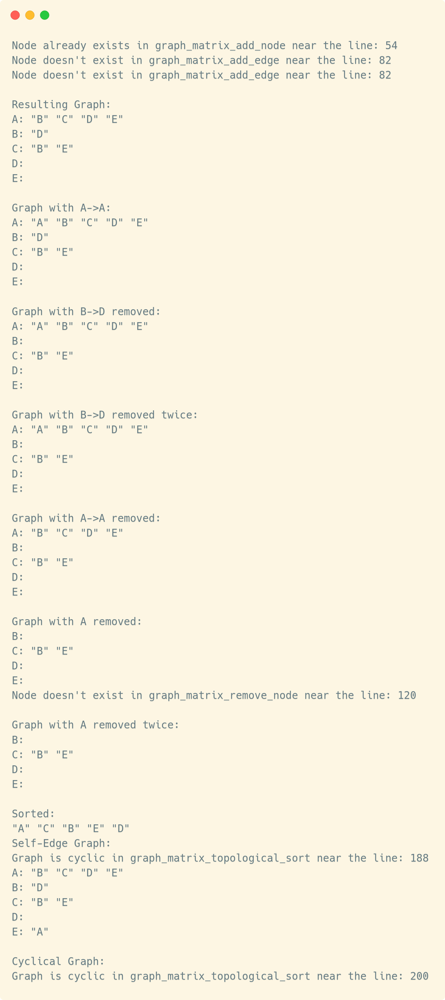
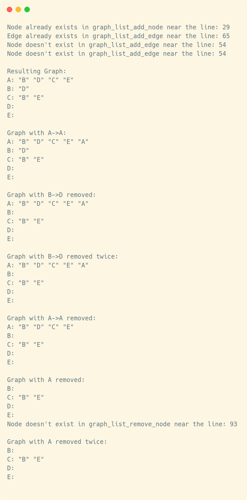

= Abgabe 05
:author: Florian Weingartshofer
:email: <S1910307103@students.fh-hagenberg.at>
:reproducible:
:listing-caption: Listing
:source-highlighter: rouge
:sourcedir: ../src
:toc:
:toclevels: 4

<<<
== Lösungsideen
=== Graph Matrix
Die Knoten werden in einem eigenem Array gespeichert,
die Kanten werden in einem anderen Bool Array gespeichert.
Dieser ist `n²` groß und wird wie eine Matrix behandelt.
Die Spalten stellen die Knoten dar von denen die Kanten weggehen
und die Zeilen sind die Knoten zu denen die Kanten führen.
[source]
----
    A B C D E
    0 1 2 3 4
A 0 0 0 0 0 0
B 1 1 0 0 0 0 <1>
C 2 0 0 0 0 1 <2>
D 3 0 0 0 0 0
E 4 0 0 0 0 0
----
<1> Hier zeigt A auf B
<2> E zeigt auf C

=== Initialisieren des Graphen
Es wird `n` Speicherraum für den Node Array reserviert
und `n²` Speicherraum für die Edge Matrix.
Die `size` wird mit `2` initialisiert und `count` mit `0`

=== Enfügen von Knoten
Sollte der einzufügende Knoten schon vorhanden sein,
wird dieser nicht eingefügt.
Es wird der Knoten einfach an der nächste leeren Stelle im
Knoten Array eingefügt.
Sollte dieser voll sein wird er und der Edge Array vergrößert.
Die Werte im Edge Array werden entsprechend verschoben.
Dann wird der Knoten eingefügt.

=== Einfügen von Kanten
Es werden die Payloads von den Source und Destination Knoten
übergeben.
Mithilfe dieser werden dann Source und Destination Knoten ermittelt.
Dann wird an der entsprechenden Stelle in der Edge Matrix der Wert auf `true` gesetzt.

=== Ausgeben des Graphens
Es werden hintereinander alle Knoten ausgeben.
Zusätzlich werden alle Knoten ausgegeben, auf welche der Ursprungsknoten zeigt.

=== Löschen eines Knoten
Es wird der Knoten gelöscht in dem dessen Payload auf `NULL` gesetzt wird.
Der entsprechende Knoten wird mithilfe seiner Payload identifiziert.
Sollte er nicht existieren, wird er auch nicht gelöscht.
Zusätzlich werden alle Kanten gelöscht, also auf `false` gesetzt,
welche auf diesen Knoten zeigen oder von ihm ausgehen.

=== Löschen einer Kante
Die Kante wird mithilfe der Ursprungsknoten-Payload und der Zielknoten-Payload identifiziert.
Dann wird der entsprechende Wert in der Edge Matrix auf `false` gesetzt.
Soltle diese Kante nicht existieren ändert diese Aktion nichts.

=== Zerstören des Graphen
Es wird auf die Edge Matrix einfach `free` angewandt.
Dann wird der Node Array durchiteriert und jede nicht `NULL` Payload freigegeben.
Zuletzt wird noch der Node Array selbst freigegeben.

== Graph List
Die Graph List besteht aus dem `Head` der Node Elemente.
Jedes Node Element zeigt auf das Nächste und auf das `Head` Element der Edges.

=== Initialisieren des Graphen
Das `Head` Element der Nodes wird mit `NULL` initialisiert.

=== Einfügen eines Knoten
Der Knoten wird entweder in das `Head` Element gesetzt
oder ganz am Ende der Node Liste angefügt.

=== Einfügen einer Kante
Die Kante wird am Ende der Edge Liste im Source Node angehängt.
Die Edge zeigt dann auf den Zielknoten.
Der Ursprungsknoten und Zielknoten wird Mithilfe der Payload identifiziert.

=== Ausgeben des Graphens
Es wird über alle Elemente der Node List iteriert.
Die Payload wird ausgegeben, dann wird über die Edges iteriert
und die Payload von den jeweiligen Zielknoten der Edge wird ausgegeben.

=== Löschen eines Knoten
Es wird über alle Knoten iteriert bis der zu löschende Knoten gefunden wird,
wird er nicht gefunden wird die Funktion abgebrochen.
Dann werden alle ausgehenden Edges gelöscht.
Um alle eingehende Edges zu löschen muss nochmal über die Nodes iteriert werden
und deren Edge Liste, wird eine Edge gefunden welcher auf den zu löschenden Knoten zeigt,
wird diese entfernt.
Zuletzt wird noch der zu löschende Knoten entfernt.

=== Löschen einer Kante
Die Kante wird Mithilfe der Payload des Ursprungsknotens und Zielknotens identifiziert.
Dann wird die Kante aus der List entfernt.
Sollte die Kante nicht gefunden werden, wird nichts getan.

=== Zerstören des Graphens
Es wird über alle Nodes iteriert,
und über alle Edges iteriert, diese werden dann nacheinander freigegeben.
Dann wird der jeweilige Knoten freigegeben.

== Topologisches Sortieren
*Wurde mit der Matrix realisiert*

Es wird eine Kopie des Node Arrays erstellt,
diese Kopie enthält pro Knoten noch zusätzlich die Anzahl der eingehenden Knoten
und eine `Bool` flag, welche aussagt ob der Knoten schonmal ausgegeben wurde, bzw.
ob er zu ausgeben ist.
Dieser Hilfsarray wird durchiteriert und jeder Knoten mit `0` eingehenden Kanten
wird ausgegeben.
Dann wird die `Bool` Flag des Nodes auf `true` gesetzt.
Nach jedem kompletten Durchlauf wird der Hilfsarray neu berechnet,
wobei alle Knoten mit der `Bool` Flag auf `true`
bei der Berechnung der eingehenden Kanten ignoriert werden.
Dann werden wieder alle Knoten ausgegeben, welche `0` eingehende Kanten haben.
Dies wird so oft durchgeführt bis alle Knoten eine `true` auf der `Bool` Flag haben
oder bis ein kompletter Durchlauf ohne Ausgabe erfolgt.
Dies würde bedeuten, dass der Graph zyklisch ist und die Funktion wird abgebrochen.

*Achtung: Es wird ein Teil des Graphens ausgegeben, bis der Zyklus erkannt wird!*

*Diese Funktionalität ist zu Testzwecken erwünscht.*

Sonst können die Ergebnisse auch später einfach in einen Array gespeichert werden
und dieser wird am Ende ausgegeben.

<<<
== Source Code
=== Graph Matrix

.graph_matrix.h
[source,c]
----
include::{sourcedir}/adt/graph_matrix.h[]
----

.graph_matrix.c
[source,c]
----
include::{sourcedir}/adt/graph_matrix.c[lines=1..166]

include::{sourcedir}/adt/graph_matrix.c[lines=241..]
----

.graph_list.h
[source,c]
----
include::{sourcedir}/adt/graph_list.h[]
----

.graph_list.c
[source,c]
----
include::{sourcedir}/adt/graph_list.c[]
----

.top.h
[source,c]
----
include::{sourcedir}/top/top.h[]
----

.top.c
[source,c]
----
include::{sourcedir}/top/top.c[]
----

.utils.h
[source,c]
----
include::{sourcedir}/adt/utils.h[]
----

.utils.c
[source,c]
----
include::{sourcedir}/adt/utils.c[]
----

== Test-Cases
Test Cases für Matrix und List.

.main.c
[source,c]
----
include::{sourcedir}/adt/main.c[]
----

=== Graph Matrix

.Ausgabe der Matrix Testfälle mit Sotieren.
[source]
----
Node already exists in graph_matrix_add_node near the line: 54
Node doesn't exist in graph_matrix_add_edge near the line: 82
Node doesn't exist in graph_matrix_add_edge near the line: 82

Resulting Graph:
A: "B" "C" "D" "E"
B: "D"
C: "B" "E"
D:
E:

Graph with A->A:
A: "A" "B" "C" "D" "E"
B: "D"
C: "B" "E"
D:
E:

Graph with B->D removed:
A: "A" "B" "C" "D" "E"
B:
C: "B" "E"
D:
E:

Graph with B->D removed twice:
A: "A" "B" "C" "D" "E"
B:
C: "B" "E"
D:
E:

Graph with A->A removed:
A: "B" "C" "D" "E"
B:
C: "B" "E"
D:
E:

Graph with A removed:
B:
C: "B" "E"
D:
E:
Node doesn't exist in graph_matrix_remove_node near the line: 120

Graph with A removed twice:
B:
C: "B" "E"
D:
E:

Sorted:
"A" "C" "B" "E" "D"
Self-Edge Graph:
Graph is cyclic in graph_matrix_topological_sort near the line: 188
A: "B" "C" "D" "E"
B: "D"
C: "B" "E"
D:
E: "A"

Cyclical Graph:
Graph is cyclic in graph_matrix_topological_sort near the line: 200
----

.Ausgabe der Matrix Testfälle

=== Graph List

.Ausgabe der List Testfälle
[source]
----
Node already exists in graph_list_add_node near the line: 29
Edge already exists in graph_list_add_edge near the line: 65
Node doesn't exist in graph_list_add_edge near the line: 54
Node doesn't exist in graph_list_add_edge near the line: 54

Resulting Graph:
A: "B" "D" "C" "E"
B: "D"
C: "B" "E"
D:
E:

Graph with A->A:
A: "B" "D" "C" "E" "A"
B: "D"
C: "B" "E"
D:
E:

Graph with B->D removed:
A: "B" "D" "C" "E" "A"
B:
C: "B" "E"
D:
E:

Graph with B->D removed twice:
A: "B" "D" "C" "E" "A"
B:
C: "B" "E"
D:
E:

Graph with A->A removed:
A: "B" "D" "C" "E"
B:
C: "B" "E"
D:
E:

Graph with A removed:
B:
C: "B" "E"
D:
E:
Node doesn't exist in graph_list_remove_node near the line: 93

Graph with A removed twice:
B:
C: "B" "E"
D:
E:
----

.Ausgabe der List Testfälle

