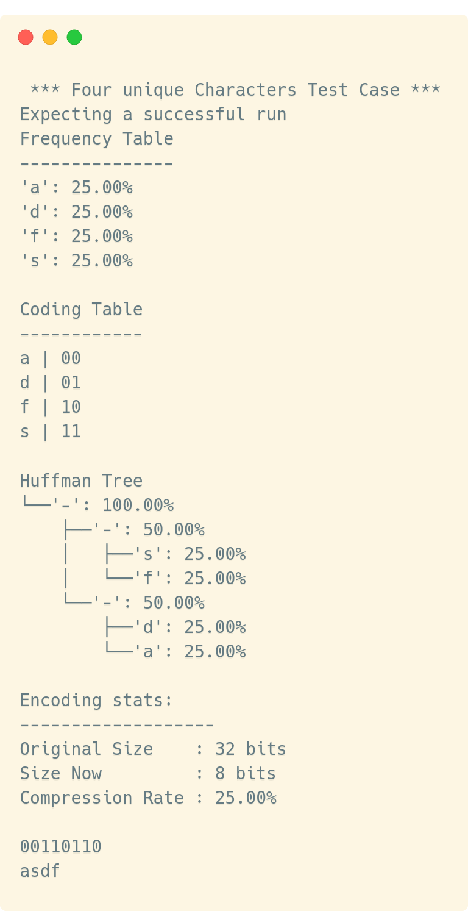
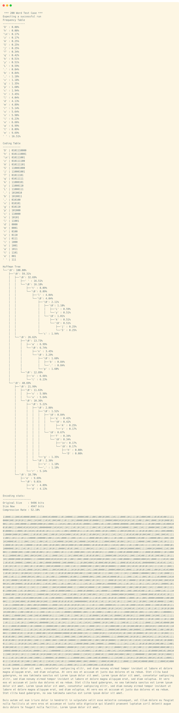

= Abgabe 07: Huffman
:author: Florian Weingartshofer
:email: <S1910307103@students.fh-hagenberg.at>
:reproducible:
:experimental:
:listing-caption: Listing
:source-highlighter: rouge
:sourcedir: ../src/huffman
:imgdir: ./img
:toc:
:toclevels: 4

<<<
== Lösungsidee
*Annahme: Es dürfen `set`, `vector`, `map`, etc genutzt werden,
da dazu nichts in der Angabe steht.*

*Achtung: Die Klassen wurden wie in der Angabe implementiert,
allerdings kann die Namensgebung zur besseren Lesbarkeit abweichen*

.Klassen-Diagram, für mehr Lesbarkeit wurden bestimmte Schlüsselwörter, wie `const`, weggelassen
[plantuml, diagram-classes, png]
....
abstract class bit_stream{
    # string filename
    + bit_stream(string filename)
    + \~bit_stream()
    + {abstract} string content()
}
class bit_string_stream {
    + bit_string_stream(string filename)
    + \~bit_string_stream()
    + string content()
}
class default_stream {
    - string value
    + default_stream(string value)
    + string content()
}

abstract class content {
    # bit_stream *stream
    + content()
    + content(string file)
    + \~content()
    + {abstract} encode()
    + {abstract} decode(string encoded)
}
class huffman_content {
    # coding_token *token
    + huffman_content()
    + huffman_content(string filename)
    + \~huffman_content()
    + string encode()
    + string decode(string encoded)
    + void statistics()
}
class huffman_default_content {
    + huffman_default_content(string value)
}

class bit_code {
    - vector<bool> bits
    - char key
    + bit_code()
    + bit_code(vector<bool> bits)
    + void print()
    + string to_string()
    + char get_character()
}

class bit_code_table {
    - vector<bit_code> bit_codes
    - void bit_code_table_rec(huffman_tree_node *node, vector<bool> &bit_vec = vector<bool>{})
    + bit_code_table(huffman_tree &tree)
    + bit_code find_code_of_char(char key)
    + void print(vector<char> &ordering)
    + vector<bit_code> all_codes()
}

class char_frequency {
    - {static} int count
    - int id = count++
    - char character
    - int frequency
    - size_t total
    + char_frequency()
    + char_frequency(char character, int frequency, size_t total)
    + char_frequency operator+(char_frequency &freq)
    + bool operator<(char_frequency &freq)
    + bool operator>(char_frequency &freq)
    + char get_character()
    + string to_string()
}

class coding_token {
    - frequency_table freq_table
    - huffman_tree tree
    - bit_code_table code_table
    + coding_token(string &content)
    + void print()
    + bit_code char_to_bit_code(char key)
    + vector<bit_code> codes()
}

class frequency_table {
    - map<char, int> frequencies
    - size_t total = 0
    + frequency_table(string &str)
    + void print()
    + vector<char> sorted_keys()
    - set<huffman_tree_node *, comparator> to_set()
    + {static} delete_huffman_frequency_set(set<huffman_tree_node *, comparator> &set)
}

class huffman_tree {
    - huffman_tree_node *root
    + huffman_tree(frequency_table &freq_table)
    + \~huffman_tree()
    + huffman_tree_node *get_root()
    + void print()
}

class huffman_tree_node {
    - huffman_tree_node *left
    - huffman_tree_node *right
    - char_frequency value
    + huffman_tree_node()
    + huffman_tree_node(char_frequency char_frequency)
    + huffman_tree_node(char_frequency char_frequency,
                        huffman_tree_node *node1, huffman_tree_node *node2)
    + \~huffman_tree_node()
    + huffman_tree_node get_left()
    + huffman_tree_node get_right()
    + huffman_tree_node get_value()
    + bool is_leaf()
    + huffman_tree_node &operator+(huffman_tree_node *node)
    + bool operator<(huffman_tree_node &node)
    + void print()
    - void print_rec(string &prefix, bool is_right)
}

object comparator {
    + bool operator()(huffman_tree_node *l, huffman_tree_node *r)
}

object utils {
    + string escape_char_to_printable(char c, string &padding = " ", std::string &enclose = "'");
}

bit_stream <|-- bit_string_stream
bit_stream <|-- default_stream

content <|-- huffman_content
huffman_content <|-- huffman_default_content

content "1" --> "1" bit_string_stream: erzeugt
huffman_default_content "1" --> "1" default_stream: erzeugt

huffman_content "1" --> "1" coding_token: erzeugt

bit_code_table "1" --> "n" bit_code: erzeugt
bit_code_table "1" ..> "1" huffman_tree: erhält

coding_token "1" --> "1" bit_code_table: erzeugt
coding_token "1" --> "1" frequency_table: erzeugt
coding_token "1" --> "1" huffman_tree: erzeugt

frequency_table "1" --> "n" huffman_tree_node: erzeugt
frequency_table "1" --> "n" char_frequency: erzeugt

huffman_tree "1" ..> "1" frequency_table: erhält

huffman_tree_node "1" ..> "1" char_frequency: erhält

huffman_tree_node "1" --> "1" comparator: enthält

frequency_table "1" --> "1" utils: nutzt
bit_code_table "1" --> "1" utils: nutzt
....

=== bit_stream
Nur eine abstrakte Klasse, welche die von den anderen Streams zu implementierenden Methoden vorgibt.

==== default_stream
Erhält eine String value, welche einfach als Inhalt zurückgegeben wird.
Dadurch wird das Testen wesentlich vereinfacht,
da nicht für jeden Testfall ein neues File erzeugt werden muss.

https://en.wikipedia.org/wiki/Mock_object[Siehe Mocking.]

==== bit_string_stream
Erhält einen File-Pfad und versucht das File an dieser Stelle auszulesen.

=== content
*Aka `text_coder`, allerdings finde ich den Namen sehr unpassend, daher `content`*

`content` und die davon abgeleiteten Klassen repräsentieren den Inhalt eines Files.
Der Inhalt kann kodiert und dekotiert werden.
`huffman_content` und dessen abgeleiteten Klassen,
können auch eine Statistik anzeigen.

==== huffman_content
Erzeugt einen `coding_token`, mithilfe dessen der Inhalt kodiert oder dekodiert werden kann.
Die `statistics` Methode gibt den kodierten und dekotierten Inhalt aus,
die Kompressionsrate, die Häufigkeitstabelle und die Kodierungstabelle.

==== huffman_default_content
Abgeleitet von `huffman_content` erstellt statt einem `bit_string_stream`,
einen `default_stream` und nutzt dessen Inhalt.

=== coding_token
Erzeugt die benötigten Tabellen und den Huffman-Baum.

=== frequency_table
*Aka `huffman_list`, hier auch wieder eine zweideutige Benennung aus meiner Sicht.*

Erhält einen String. Alle Zeichen werden als Key in eine `map` gespeichert.
Sollte ein Zeichen doppelt vorkommen, wird die Value an der Stelle des Keys um eins erhöht.

Da `maps` nach Keys sortiert werden,
gibt es eine eigene `to_set` Funktion, welche die `map` in ein `set` umwandelt.
Das `set` enthält die einzelnen `huffman_tree_nodes`, und ist nach diesen auch sortiert.

Ein Nachteil dieser Implementierung ist, dass das `set` nach Benutzung eventuell gelöscht werden muss.

=== char_frequency
Repräsentiert wie oft ein bestimmter `char` in einem `string` vorkommt.
Es werden auch die `+`, `<` und `>` Operatoren überladen.
Eine `char_frequency` ist kleiner falls die `frequency` kleiner ist
oder sollte sie gleich groß sein, der `character` kleiner ist.
Sollten die beiden `char_frequencies` in dieser Hinsicht ident sein,
gibt es eine `id`, welche zuletzt verglichen wird.
Dadurch wird gewährleistet, dss jede `char_frequency` eindeutig größer oder kleiner ist.

Bei der Addition wird die `frequency` beider `char_frequencies` aufaddiert
und die daraus entstehende neue `char_frequency` bekommt einen Nullterminator als `character`,
sollten die ursprünglichen `character` ungleich sein, sonst wird der alte `character` übernommen.

.Addition von zwei `char_frequencies`
[plantuml, char_frequency_addition, png]
....
object char_frequency1 {
    int id = 0
    char character = 'a'
    int frequency = 10
}

object char_frequency2 {
    int id = 1
    char character = 'b'
    int frequency = 3
}

object char_frequency3 {
    int id = 2
    char character = '\0'
    int frequency = 13
}

() add

char_frequency1  --> add
char_frequency2  --> add
add --> char_frequency3
....

=== huffman_tree
Erzeugt aus einem `frequency_table` einen `huffman_tree`.

Zum Erzeugen des Baumes wird der Algorithmus laut Angabe genutzt.
Die ersten zwei `huffman_tree_nodes` in einem geordentem `set<huffman_tree_node*>`,
werden mithilfes überladenen `+` Operator verknüpft,
dieser erzeugt dann einen neuen Root-Knoten,
welcher in das sortierte `set` eingefügt wird.
Die beiden alten Knoten werden aus dem `set` entfernt.
Dies geschieht solange bis nur noch ein Element in dem `set` vorhanden ist.
Das übrig gebliebene Element in dem `set` wird dann als Root-Knoten genutzt.

=== huffman_tree_node
Ist Teil eines `huffman_tree` und enthält selber noch einen linken und rechten Knoten.
Der `huffman_tree_node` enthält mehrere Konstrukoren um die Value(`char_frequency`)
und die Knoten links, rechts zu initialisieren.
Ausserdem werden die `+` und `<` Operatoren überladen.

Ein Node ist kleiner als ein zweiter, wenn die darin enthaltene `char_frequency` kleiner ist.

Bei der Addition wird ein neuer Root-Node erzeugt und die zu addierenden Nodes werden eingefügt.
Als `char_frequency` im neuen Root-node werden die beiden `char_frequencies` der ursprünglichen Nodes addiert.

.`huffman_tree_node` Addition
[graphviz, "huffman_node_add"]
---------------------------------------------------------------------
digraph addition {
    { rank=same NodeLeft add NodeRight }
    NodeLeft
    add [shape=none]
    NodeRight
    "NodeLeft" -> "add" [arrowhead=none]
    "add" -> "NodeRight" [arrowhead=none]
}
---------------------------------------------------------------------

.Ergebnis einer `huffman_tree_node` Addition
[graphviz, "huffman_node_add_result"]
---------------------------------------------------------------------
digraph addition {
    { rank=same NodeLeft NodeRight }
    Root
    NodeLeft
    NodeRight
    Root -> {NodeLeft, NodeRight}
}
---------------------------------------------------------------------

=== bit_code_table
Erhält einen `huffman_tree` und erzeugt daraus den `bit_code_table`.

Dabei wird der Baum rekursiv durchiteriert.
Für jedes mal nach links oder rechts gehen im Baum,
wird ein `true`(rechts) oder `false`(links) in einen `vector<bool>` gespeichert.
Dieser `vector<bool>` wird in der rekursiven Funktion by value übergeben,
dadurch wird jedes mal eine Kopie des `vector` erzeugt.
Der Rekursionsboden ist erreicht, wenn der Knoten ein Leaf in dem Baum ist,
dann wird der erzeugt `vector<bool>` und der `char` der an dieser Stelle im Baum steht,
in Form eines `bit_code` in den `vector<bit_code>` hinzugefügt.

Sollte der Baum allerdings nur den Root-Knoten enthalten, wird dieser direkt(ohne Rekursion),
in den `vector<bit_code>` eingefügt.
Der Code für diesen einen `char` ist dann einfach `0`.

=== bit_code
Repräsentiert einen einen `character` mit seinem Code, dieser ist ein `vector<bool>`.

<<<
== Source-Code
.bit_stream/bit_stream.h
[source,cpp]
----
include::{sourcedir}/bit_stream/bit_stream.h[]
----

.bit_stream/bit_stream.cpp
[source,cpp]
----
include::{sourcedir}/bit_stream/bit_stream.cpp[]
----

.bit_stream/bit_string_stream.h
[source,cpp]
----
include::{sourcedir}/bit_stream/bit_string_stream.h[]
----

.bit_stream/bit_string_stream.cpp
[source,cpp]
----
include::{sourcedir}/bit_stream/bit_string_stream.cpp[]
----

.bit_stream/default_stream.h
[source,cpp]
----
include::{sourcedir}/bit_stream/default_stream.h[]
----

.bit_stream/default_stream.cpp
[source,cpp]
----
include::{sourcedir}/bit_stream/default_stream.cpp[]
----

.content/content.h
[source,cpp]
----
include::{sourcedir}/content/content.h[]
----

.content/content.cpp
[source,cpp]
----
include::{sourcedir}/content/content.cpp[]
----

.content/huffman_content.h
[source,cpp]
----
include::{sourcedir}/content/huffman_content.h[]
----

.content/huffman_content.cpp
[source,cpp]
----
include::{sourcedir}/content/huffman_content.cpp[]
----

.content/huffman_default_content.h
[source,cpp]
----
include::{sourcedir}/content/huffman_default_content.h[]
----

.content/huffman_default_content.cpp
[source,cpp]
----
include::{sourcedir}/content/huffman_default_content.cpp[]
----

.coding_token.h
[source,cpp]
----
include::{sourcedir}/coding_token.h[]
----

.coding_token.cpp
[source,cpp]
----
include::{sourcedir}/coding_token.cpp[]
----

.frequencies/frequency_table.h
[source,cpp]
----
include::{sourcedir}/frequencies/frequency_table.h[]
----

.frequencies/frequency_table.cpp
[source,cpp]
----
include::{sourcedir}/frequencies/frequency_table.cpp[]
----

.frequencies/char_frequency.h
[source,cpp]
----
include::{sourcedir}/frequencies/char_frequency.h[]
----

.frequencies/char_frequency.cpp
[source,cpp]
----
include::{sourcedir}/frequencies/char_frequency.cpp[]
----

.huffman_tree/huffman_tree.h
[source,cpp]
----
include::{sourcedir}/huffman_tree/huffman_tree.h[]
----

.huffman_tree/huffman_tree.cpp
[source,cpp]
----
include::{sourcedir}/huffman_tree/huffman_tree.cpp[]
----

.huffman_tree/huffman_tree_node.h
[source,cpp]
----
include::{sourcedir}/huffman_tree/huffman_tree_node.h[]
----

.huffman_tree/huffman_tree_node.cpp
[source,cpp]
----
include::{sourcedir}/huffman_tree/huffman_tree_node.cpp[]
----

.bit_code/bit_code_table.h
[source,cpp]
----
include::{sourcedir}/bit_code/bit_code_table.h[]
----

.bit_code/bit_code_table.cpp
[source,cpp]
----
include::{sourcedir}/bit_code/bit_code_table.cpp[]
----

.bit_code/bit_code.h
[source,cpp]
----
include::{sourcedir}/bit_code/bit_code.h[]
----

.bit_code/bit_code.cpp
[source,cpp]
----
include::{sourcedir}/bit_code/bit_code.cpp[]
----

.utils.h
[source,cpp]
----
include::{sourcedir}/utils.h[]
----

.utils.cpp
[source,cpp]
----
include::{sourcedir}/utils.cpp[]
----

.main.cpp
[source,cpp]
----
include::{sourcedir}/main.cpp[]
----

== Test-Cases
Zum Testen auf Memory Leaks wurde https://valgrind.org[valgrind] verwendet.
Es wird mit folgendem Command getestet:

.Valgrind Command
[source]
----
valgrind --tool=memcheck --leak-check=full --leak-resolution=med --track-origins=yes --vgdb=no -s ./huffman
----

=== Standard Test-Case
Es wurde das Beispiel aus der Angabe genutzt.
Es wird eine erfolgreiche Operation erwartet.

.Standard Test-Case
[source,cpp]
----
include::{sourcedir}/main.cpp[lines=9..16]
----

.Standard Test-Case Output
[source]
----
include::tests/standard_test.txt[]
----

.Standard Test-Case Output

.Standard Valgrind
[source]
----
==17507== HEAP SUMMARY:
==17507==     in use at exit: 0 bytes in 0 blocks
==17507==   total heap usage: 1,060 allocs, 1,060 frees, 115,274 bytes allocated
==17507==
==17507== All heap blocks were freed -- no leaks are possible
==17507==
==17507== ERROR SUMMARY: 0 errors from 0 contexts (suppressed: 0 from 0)
----

=== Read From Existing File Test-Case
Es wird eine erfolgreiche Operation erwartet.

.Read From Existing File Test-Case
[source, cpp]
----
include::{sourcedir}/main.cpp[lines=18..30]
----

.Read From Existing File Output
[source]
----
include::tests/existing_file.txt[]
----

.Read From Existing File Output

.Read From Existing File Valgrind
[source]
----
==16970== HEAP SUMMARY:
==16970==     in use at exit: 0 bytes in 0 blocks
==16970==   total heap usage: 1,077 allocs, 1,077 frees, 150,289 bytes allocated
==16970==
==16970== All heap blocks were freed -- no leaks are possible
==16970==
==16970== ERROR SUMMARY: 0 errors from 0 contexts (suppressed: 0 from 0)
----

=== Read From Non Existing File Test-Case
Es wird ein `runtime_error` erwartet.

.Read From Non Existing File Test-Case
[source, cpp]
----
include::{sourcedir}/main.cpp[lines=32..44]
----

.Read From Non Existing File Output
[source]
----
include::tests/non_existing.txt[]
----

.Read From Non Existing File Output

.Read From Non Existing File Valgrind
[source]
----
==22078== HEAP SUMMARY:
==22078==     in use at exit: 0 bytes in 0 blocks
==22078==   total heap usage: 9 allocs, 9 frees, 74,562 bytes allocated
==22078==
==22078== All heap blocks were freed -- no leaks are possible
==22078==
==22078== ERROR SUMMARY: 0 errors from 0 contexts (suppressed: 0 from 0)
----

=== Read From Empty File Test-Case
Es wird eine `invalid_argument` Exception erwartet.

.Read From Empty File Test-Case
[source,cpp]
----
include::{sourcedir}/main.cpp[lines=46..59]
----

.Read From Empty File Output
[source]
----
include::tests/empty_file.txt[]
----

.Read From Empty File Output

.Read From Empty File Valgrind
[source]
----
==23536== HEAP SUMMARY:
==23536==     in use at exit: 0 bytes in 0 blocks
==23536==   total heap usage: 10 allocs, 10 frees, 82,752 bytes allocated
==23536==
==23536== All heap blocks were freed -- no leaks are possible
==23536==
==23536== ERROR SUMMARY: 0 errors from 0 contexts (suppressed: 0 from 0)
----

=== Empty Content Test-Case
Es wird eine `invalid_argument` Exception erwartet.

.Empty Content Test-Case
[source,cpp]
----
include::{sourcedir}/main.cpp[lines=60..72]
----

.Empty Content Output
[source]
----
include::tests/empty_content.txt[]
----

.Empty Content Output

.Empty Content Valgrind
[source]
----
==24947== HEAP SUMMARY:
==24947==     in use at exit: 0 bytes in 0 blocks
==24947==   total heap usage: 6 allocs, 6 frees, 74,074 bytes allocated
==24947==
==24947== All heap blocks were freed -- no leaks are possible
==24947==
==24947== ERROR SUMMARY: 0 errors from 0 contexts (suppressed: 0 from 0)
----

=== Single Character Test-Case
Es wird eine erfolgreiche Operation erwartet.

.Single Character Test-Case
[source, cpp]
----
include::{sourcedir}/main.cpp[lines=74..81]
----

.Single Character Output
[source]
----
include::tests/single_char.txt[]
----

.Single Character Output
image::tests/single_char.png[Single Character Output]

.Single Character Valgrind
[source]
----
==26150== HEAP SUMMARY:
==26150==     in use at exit: 0 bytes in 0 blocks
==26150==   total heap usage: 19 allocs, 19 frees, 74,305 bytes allocated
==26150==
==26150== All heap blocks were freed -- no leaks are possible
==26150==
==26150== ERROR SUMMARY: 0 errors from 0 contexts (suppressed: 0 from 0)
----

=== Four Unique Characters Test-Case
Es wird eine erfolgreiche Operation erwartet.

.Four Unique Characters Test-Case
[source,cpp]
----
include::{sourcedir}/main.cpp[lines=83..90]
----

.Four Unique Characters Output
[source]
----
include::tests/four_characters.txt[]
----

.Four Unique Characters Output

.Four Unique Characters Valgrind
[source]
----
==27940== HEAP SUMMARY:
==27940==     in use at exit: 0 bytes in 0 blocks
==27940==   total heap usage: 86 allocs, 86 frees, 76,308 bytes allocated
==27940==
==27940== All heap blocks were freed -- no leaks are possible
==27940==
==27940== ERROR SUMMARY: 0 errors from 0 contexts (suppressed: 0 from 0)
----

=== Simple Test-Case
Es wird eine erfolgreiche Operation erwartet.

.Simple Test-Case
[source,cpp]
----
include::{sourcedir}/main.cpp[lines=92..99]
----

.Simple Output
[source]
----
include::tests/simple.txt[]
----

.Simple Output
image::tests/simple.png[Simple Output]

.Simple Valgrind
[source]
----
==47585== HEAP SUMMARY:
==47585==     in use at exit: 0 bytes in 0 blocks
==47585==   total heap usage: 81 allocs, 81 frees, 76,291 bytes allocated
==47585==
==47585== All heap blocks were freed -- no leaks are possible
==47585==
==47585== ERROR SUMMARY: 0 errors from 0 contexts (suppressed: 0 from 0)
----

=== 200 Word Test-Case
Es wird eine erfolgreiche Operation erwartet.

.200 Word Test-Case
[source,cpp]
----
include::{sourcedir}/main.cpp[lines=101..108]
----

.200 Word Output
[source]
----
include::tests/200.txt[]
----

.200 Word Output

.200 Word Valgrind
[source]
----
==50861== HEAP SUMMARY:
==50861==     in use at exit: 0 bytes in 0 blocks
==50861==   total heap usage: 43,706 allocs, 43,706 frees, 4,364,156 bytes allocated
==50861==
==50861== All heap blocks were freed -- no leaks are possible
==50861==
==50861== ERROR SUMMARY: 0 errors from 0 contexts (suppressed: 0 from 0)
----
